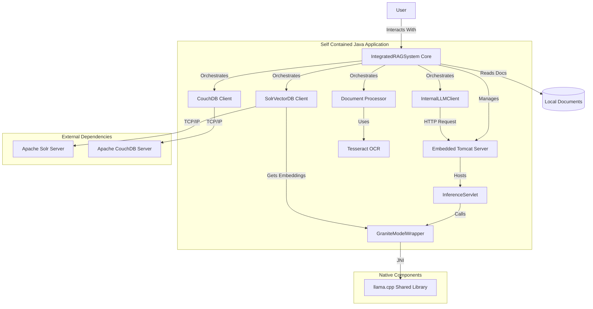
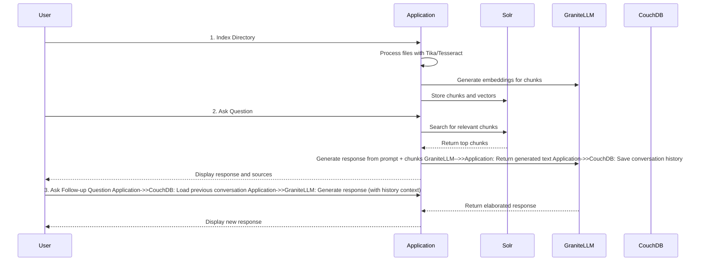

# Self-Contained RAG Notebook

A self-contained, local-first RAG (Retrieval-Augmented Generation) application that functions as a personal notebook. It allows you to use your own local documents as a knowledge base for a powerful Large Language Model, all without relying on external APIs or services.

This project is built entirely on open-source technologies, with a focus on the Apache Software Foundation ecosystem. It uses a locally-run Granite LLM for generation, Apache Solr for vector search, Apache CouchDB for conversation history, and Apache Tika for document processing.

## Table of Contents

- [Architecture Diagram](https://www.google.com/search?q=%23architecture-diagram)
- [Features](https://www.google.com/search?q=%23features)
- [Setup Guide](https://www.google.com/search?q=%23setup-guide)
     - [Option 1: Containerized Setup (Recommended)](https://www.google.com/search?q=%23option-1-containerized-setup-recommended-docker-or-podman)
     - [Option 2: Non-Docker / Manual Setup](https://www.google.com/search?q=%23option-2-non-docker--manual-setup)
- [Usage Guide](https://www.google.com/search?q=%23usage-guide)
     - [1. Start Backend Services](https://www.google.com/search?q=%231-start-backend-services)
     - [2. Configure the Solr Core](https://www.google.com/search?q=%232-configure-the-solr-core)
     - [3. Run the Application](https://www.google.com/search?q=%233-run-the-application)
     - [4. Interact with the Application](https://www.google.com/search?q=%234-interact-with-the-application)
     - [Usage Flow Diagram](https://www.google.com/search?q=%23usage-flow-diagram)
- [Contributing](https://www.google.com/search?q=%23contributing)
- [License](https://www.google.com/search?q=%23license)
- [Components & Third-Party Licenses](https://www.google.com/search?q=%23components--third-party-licenses)

## Architecture Diagram

This diagram illustrates the components of the self-contained application and how they interact.




## Features

- **Local-First RAG**: Uses documents from a local folder as the context for all AI responses. Your data stays on your machine.
- **Self-Contained LLM**: Runs the IBM Granite LLM locally using an embedded Tomcat server, eliminating the need for external APIs or services.
- **Robust Vector Search**: Leverages Apache Solr for powerful hybrid search capabilities (semantic vector search + keyword search).
- **Comprehensive Document Support**: Employs Apache Tika and a Tesseract OCR backend to extract text from a wide variety of formats, including scanned PDFs and images.
- **Conversational Memory**: Saves all interactions to an Apache CouchDB database, allowing for conversational follow-ups and history search.
- **Flexible Deployment**: Supports both fully containerized (Docker/Podman) and manual, non-containerized setups.
- **Built with Maven**: The entire project, including the native C++ JNI wrapper, is built and managed with Apache Maven.

## Setup Guide

Choose one of the following methods to set up the application and its dependencies.

---

### Option 1: Containerized Setup (Recommended: Docker or Podman)

This method uses a `compose.yml` file to run the backend services (Solr, CouchDB) in containers. It is the simplest and most reproducible way to get started.

#### Prerequisites

- **Git**: For cloning the repository.
- **Red Hat OpenJDK 17**: Or any other Java 17 distribution.
- **Apache Maven**: For building the project.
- **A Container Engine**:
     - **Docker** with **Docker Compose**.
     - **Podman** with **`podman-compose`** (or another Compose-compatible tool).
- **Tesseract OCR**: Required by Apache Tika for processing images and scanned PDFs.
- **C++ Build Toolchain**: `CMake` and a C++ compiler (like GCC or Clang) for building the `llama.cpp` wrapper.

#### Configuration & Build Steps

1. **Clone the Repository and Submodule**:
   
   
   
   ```bash
   git clone <repository-url>
   cd <repository-directory>
   git submodule add https://github.com/ggerganov/llama.cpp.git
   git submodule update --init --recursive
   ```

2. **Download the Granite Model**: Download the `granite-8b-instruct-v3.2` GGUF model from the [IBM Hugging Face Hub](https://www.google.com/search?q=https://huggingface.co/ibm-granite/granite-8b-instruct-v3.2-gguf) and place it in a `models/` directory inside the project root.

3. **Create `compose.yml`**: Create a file named `compose.yml` in the project root. This file is compatible with both `docker-compose` and `podman-compose`.
   
   
   
   ```yaml
   version: '3.8'
   services:
    solr:
      image: solr:9.6
      ports:
        - "8983:8983"
      volumes:
        - solr_data:/var/solr
      command:
        - solr-precreate
        - documents # This creates the core on startup
   
    couchdb:
      image: couchdb:3.3
      ports:
        - "5984:5984"
      volumes:
        - couchdb_data:/opt/couchdb/data
      environment:
        - COUCHDB_USER=admin
        - COUCHDB_PASSWORD=password
   
   volumes:
    solr_data:
    couchdb_data:
   ```

4. **Configure Application Properties**: Create `src/main/resources/application.properties` and configure the paths and credentials. The default credentials match the `compose.yml` file.
   
   ```yaml
   # Absolute path to your downloaded .gguf model file
   rag.config.graniteModelPath=/path/to/your/project/models/granite-8b-instruct-v3.2.Q4_K_M.gguf
   # Absolute path to the folder containing your source documents
   rag.config.documentsPath=/path/to/your/project/source-documents
   
   # --- Service URLs ---
   rag.config.solrUrl=http://localhost:8983/solr
   rag.config.couchDbUrl=http://localhost:5984
   # ... other properties from previous steps ...
   ```

5. **Build the Application**: Run the Maven `package` command with the `native-build` profile to compile the C++ wrapper and the Java application.
   
   
   
   ```bash
   mvn clean package -Pnative-build
   ```

---

### Option 2: Non-Docker / Manual Setup

This method involves manually installing and running Solr and CouchDB directly on your host machine.

#### Prerequisites

- All prerequisites from the containerized setup, **except** for Docker/Podman.

#### Installation & Build Steps

1. **Clone Repo, Submodule, and Download Model**: Follow steps 1 and 2 from the containerized setup.

2. **Install Apache Solr**:
   
      - Download Solr 9.6 from the [official Apache Solr website](https://solr.apache.org/downloads.html).
   
      - Extract the archive.
   
      - Start Solr:
        
        ```bash
        cd solr-9.6.0/
        bin/solr start -p 8983
        ```
   
      - Create the collection for the application:
        
        ```bash
        bin/solr create -c documents
        ```

3. **Install Apache CouchDB**:
   
      - Follow the official installation instructions for your operating system from the [Apache CouchDB website](https://www.google.com/search?q=https://couchdb.apache.org/docs/stable/install/index.html).
      - After installation, navigate to the Fauxton web interface at `http://localhost:5984/_utils/`.
      - Complete the setup wizard to create an admin user and password. **You must set the credentials to `admin` / `password`** or update them in your `application.properties` file.

4. **Configure Application Properties**: Follow step 4 from the containerized setup, ensuring the Solr and CouchDB URLs and credentials match your manual installation.

5. **Build the Application**: Follow step 5 from the containerized setup.
   
   ```bash
   mvn clean package -Pnative-build
   ```

## Usage Guide

### 1. Start Backend Services

Your next step depends on the setup method you chose:

- **For Containerized Setup**: Use `docker-compose` or `podman-compose` to start the services.
  
  ```bash
  # Using Docker
  docker-compose -f compose.yml up -d
  
  # Using Podman
  podman-compose -f compose.yml up -d
  ```

- **For Manual Setup**: Ensure the Solr and CouchDB services you installed manually are running.

### 2. Configure the Solr Core

Whether you used the containerized or manual setup, you must configure the Solr schema for vector search. Run these commands:

```bash
# Add the vector field type
curl -X POST -H 'Content-type:application/json' --data-binary '{  "add-field-type":{    "name":"knn_vector",    "class":"solr.DenseVectorField",    "vectorDimension":"384",    "similarityFunction":"cosine"  }}' http://localhost:8983/solr/documents/schema

# Add fields for our data model
curl -X POST -H 'Content-type:application/json' --data-binary '{  "add-field": {"name":"title", "type":"text_general", "stored":true},  "add-field": {"name":"content", "type":"text_general", "stored":true},  "add-field": {"name":"file_path", "type":"string", "stored":true},  "add-field": {"name":"vector", "type":"knn_vector", "stored":true}}' http://localhost:8983/solr/documents/schema
```

### 3. Run the Application

Execute the self-contained JAR file, telling Java where to find the native `llama.cpp` library you compiled.

```bash
# On Linux / macOS
java -Djava.library.path=./llama.cpp/build -jar target/your-app-name.jar
```

### 4. Interact with the Application

The application is command-line driven. Upon starting, it will present you with options:

1. **Index Documents**: Choose this option first. It will process all files in the `source-documents` folder you configured, generate embeddings, and index them in Solr.
2. **Ask a Question**: Once indexing is complete, you can start asking questions. The application will use your documents to generate a response.
3. **Elaborate on Responses**: The system maintains conversational context. You can ask follow-up questions like "Can you explain that in more detail?", and it will understand the context of the previous turn.

### Usage Flow Diagram

Code snippet



## Contributing

Contributions are welcome! Please follow these steps to contribute:

1. Fork the repository.
2. Create a new feature branch (`git checkout -b feature/your-feature-name`).
3. Make your changes and commit them with clear, descriptive messages.
4. Push your changes to your forked repository (`git push origin feature/your-feature-name`).
5. Open a Pull Request against the `main` branch of the original repository.

## License

This project is licensed under the Apache License, Version 2.0.

```
Copyright 2025 [Your Name or Organization]Licensed under the Apache License, Version 2.0 (the "License");
you may not use this file except in compliance with the License.
You may obtain a copy of the License at

    http://www.apache.org/licenses/LICENSE-2.0

Unless required by applicable law or agreed to in writing, software
distributed under the License is distributed on an "AS IS" BASIS,
WITHOUT WARRANTIES OR CONDITIONS OF ANY KIND, either express or implied.
See the License for the specific language governing permissions and
limitations under the License.
```

## Components & Third-Party Licenses

This application is built using several open-source components.

| **Component**                                                                | **License**                                                             |
| ---------------------------------------------------------------------------- | ----------------------------------------------------------------------- |
| [Apache Solr](https://solr.apache.org/)                                      | Apache License 2.0                                                      |
| [Apache CouchDB](https://couchdb.apache.org/)                                | Apache License 2.0                                                      |
| [Apache Tika](https://tika.apache.org/)                                      | Apache License 2.0                                                      |
| [Apache Tomcat](https://tomcat.apache.org/)                                  | Apache License 2.0                                                      |
| [Apache Maven](https://maven.apache.org/)                                    | Apache License 2.0                                                      |
| [Apache HttpComponents](https://hc.apache.org/)                              | Apache License 2.0                                                      |
| [Jackson Databind](https://github.com/FasterXML/jackson-databind)            | Apache License 2.0                                                      |
| [llama.cpp](https://github.com/ggerganov/llama.cpp)                          | MIT License                                                             |
| [RedHat OpenJDK 17](https://developers.redhat.com/products/openjdk/download) | GNU General Public License, version 2,<br/>with the Classpath Exception |
| [Tesseract OCR](https://github.com/tesseract-ocr/tesseract)                  | Apache License 2.0                                                      |
| [IBM Granite Models](https://huggingface.co/ibm-granite)                     | Custom (See model card for specific usage and distribution terms)       |
