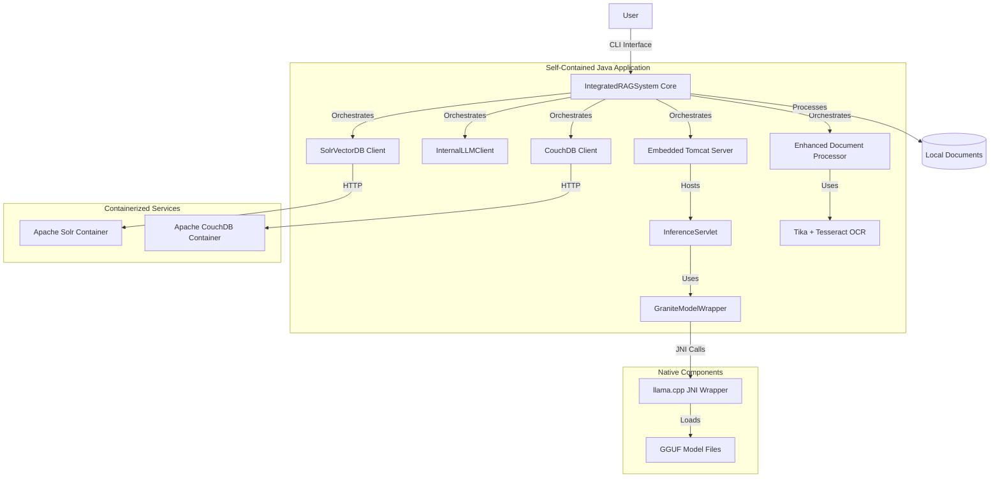
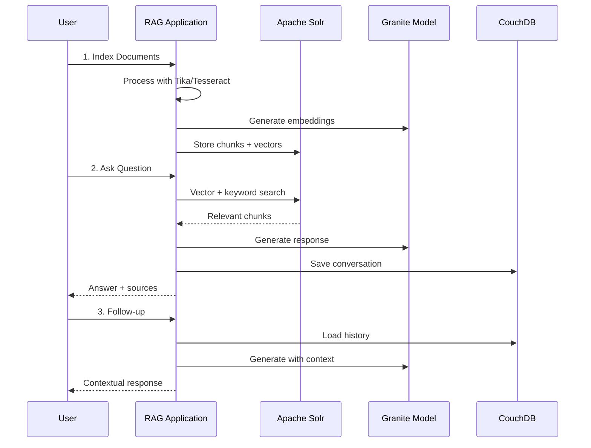

# Self-Contained RAG Notebook

A fully containerized, local-first RAG (Retrieval-Augmented Generation) application that functions as a personal notebook. Built entirely on open-source technologies with the Apache Software Foundation ecosystem at its core, this application uses a locally-run Granite LLM for generation, Apache Solr for vector search, Apache CouchDB for conversation history, and Apache Tika with Tesseract OCR for comprehensive document processing.

## Table of Contents

- [Architecture Overview](#architecture-overview)
- [Features](#features)
- [Prerequisites](#prerequisites)
- [Quick Start Guide](#quick-start-guide)
- [Detailed Setup Instructions](#detailed-setup-instructions)
- [Building the Native Components](#building-the-native-components)
- [Running the Application](#running-the-application)
- [Usage Guide](#usage-guide)
- [Troubleshooting](#troubleshooting)
- [Contributing](#contributing)
- [License](#license)

## Architecture Overview

This self-contained application orchestrates multiple components to provide a complete RAG experience:



## Features

- **Fully Containerized Backend**: Apache Solr and CouchDB run in optimized Podman/Docker containers
- **Local-First RAG**: Your documents stay on your machine, no data leaves your environment
- **Self-Contained LLM**: IBM Granite model runs locally via embedded Tomcat server
- **Advanced OCR Processing**: Tesseract OCR integration via Apache Tika for scanned documents and images
- **Hybrid Vector Search**: Semantic search combined with keyword search using Apache Solr
- **Conversational Memory**: Full conversation history stored in CouchDB
- **Comprehensive Document Support**: PDF, DOCX, images, and more via Apache Tika
- **Native Performance**: llama.cpp integration for efficient model inference

## Prerequisites

### Required Software

- **Git**: For cloning the repository and submodules
- **Java 17**: OpenJDK 17 or equivalent
- **Apache Maven 3.8+**: For building the project
- **Container Runtime**: One of the following:
  - **Podman** with **podman-compose** (recommended)
  - **Docker** with **Docker Compose**
- **C++ Build Tools**:
  - **CMake 3.15+**
  - **GCC 9+** or **Clang 10+**
  - **Make**

### System Requirements

- **RAM**: Minimum 8GB, recommended 16GB+ (for model inference)
- **Storage**: 10GB+ free space (for models and dependencies)
- **CPU**: Multi-core processor recommended for compilation

## Quick Start Guide

### 1. Clone and Initialize Repository

```bash
# Clone the repository
git clone <repository-url>
cd integrated-rag-system-self-contained

# Initialize the llama.cpp submodule
git submodule add https://github.com/ggerganov/llama.cpp.git
git submodule update --init --recursive
```

### 2. Download the Granite Model

Create a `models` directory and download the quantized GGUF model:

```bash
mkdir -p models
cd models

# Download the IBM Granite 8B Instruct model (Q4_K_M quantization)
# You can get this from: https://huggingface.co/ibm-granite/granite-8b-instruct-v3.2-gguf
# Example using wget or curl:
wget https://huggingface.co/ibm-granite/granite-8b-instruct-v3.2-gguf/resolve/main/granite-8b-instruct-v3.2.Q4_K_M.gguf

cd ..
```

### 3. Prepare Your Documents

Create a directory for your source documents:

```bash
mkdir -p source-documents
# Copy your documents (PDFs, DOCX, images, etc.) to this directory
```

### 4. Build and Run

```bash
# Build the application with native components
mvn clean package -Pnative-build

# Start the containerized services
podman-compose up -d

# Configure Solr schema
./scripts/configure-solr.sh

# Run the application
java -Djava.library.path=./llama.cpp/build -jar target/integrated-rag-system-self-contained-2.0.0.jar
```

## Detailed Setup Instructions

### Container Configuration

The application uses a `compose.yml` file optimized for Podman containers. This configuration provides:

- **Apache Solr 9.6**: Pre-configured with the `documents` core
- **Apache CouchDB 3.3**: With persistent storage and admin credentials
- **Persistent Volumes**: Data survives container restarts

The compose file is already included in the repository:

```yaml
version: '3.8'
services:
  solr:
    image: solr:9.6
    ports:
      - "8983:8983"
    volumes:
      - solr_data:/var/solr
    command:
      - solr-precreate
      - documents

  couchdb:
    image: couchdb:3.3
    ports:
      - "5984:5984"
    volumes:
      - couchdb_data:/opt/couchdb/data
    environment:
      - COUCHDB_USER=admin
      - COUCHDB_PASSWORD=password

volumes:
  solr_data:
  couchdb_data:
```

### Starting Containerized Services

For **Podman** (recommended):

```bash
# Start services
podman-compose up -d

# Check status
podman-compose ps

# View logs
podman-compose logs -f
```

For **Docker**:

```bash
# Start services
docker-compose up -d

# Check status
docker-compose ps

# View logs
docker-compose logs -f
```

### Configuring Application Properties

Create or update `src/main/resources/application.properties`:

```properties
# Model and document paths (use absolute paths)
rag.config.graniteModelPath=/absolute/path/to/your/project/models/granite-8b-instruct-v3.2.Q4_K_M.gguf
rag.config.documentsPath=/absolute/path/to/your/project/source-documents

# Service URLs (match the compose.yml configuration)
rag.config.solrUrl=http://localhost:8983/solr
rag.config.couchDbUrl=http://localhost:5984

# CouchDB authentication
rag.config.couchDbUsername=admin
rag.config.couchDbPassword=password
rag.config.couchDbDatabase=rag_conversations

# Embedding and chunking settings
rag.config.chunkSize=1000
rag.config.chunkOverlap=200
rag.config.embeddingDimension=384
```

## Building the Native Components

The application requires building native components for optimal performance:

### 1. Build llama.cpp Library

```bash
# Navigate to the llama.cpp submodule
cd llama.cpp

# Create build directory
mkdir -p build && cd build

# Configure with CMake (enable shared library)
cmake .. -DBUILD_SHARED_LIBS=ON -DCMAKE_BUILD_TYPE=Release

# Build the library
make -j$(nproc)

# Verify the shared library was created
ls -la libllama.so  # On Linux
ls -la libllama.dylib  # On macOS

cd ../..
```

### 2. Build Java Application with Native Profile

The Maven build includes a special profile for native compilation:

```bash
# Clean and build with native components
mvn clean package -Pnative-build

# This profile will:
# - Compile the llama.cpp wrapper
# - Generate JNI headers
# - Build the Java application
# - Create a fat JAR with all dependencies
```

### 3. Configure Solr Schema

After starting the containers, configure Solr for vector search:

```bash
# Add vector field type for embeddings
curl -X POST -H 'Content-type:application/json' \
  --data-binary '{
    "add-field-type": {
      "name": "knn_vector",
      "class": "solr.DenseVectorField",
      "vectorDimension": "384",
      "similarityFunction": "cosine"
    }
  }' \
  http://localhost:8983/solr/documents/schema

# Add document fields
curl -X POST -H 'Content-type:application/json' \
  --data-binary '{
    "add-field": [
      {"name": "title", "type": "text_general", "stored": true},
      {"name": "content", "type": "text_general", "stored": true},
      {"name": "file_path", "type": "string", "stored": true},
      {"name": "vector", "type": "knn_vector", "stored": true}
    ]
  }' \
  http://localhost:8983/solr/documents/schema

echo "✓ Solr schema configured successfully"
```

## Running the Application

### 1. Start Backend Services

```bash
# Start Solr and CouchDB containers
podman-compose up -d

# Wait for services to be ready
sleep 30

# Configure Solr schema (run once)
./scripts/configure-solr.sh
```

### 2. Launch the RAG Application

```bash
# Set the native library path and run
java -Djava.library.path=./llama.cpp/build \
     -Xmx8g \
     -jar target/integrated-rag-system-self-contained-2.0.0.jar
```

### 3. Application Startup Sequence

The application will:

1. **Load Configuration**: Read application.properties
2. **Initialize Components**: Start Tomcat server, load Granite model
3. **Connect to Services**: Verify Solr and CouchDB connectivity
4. **Present CLI Menu**: Interactive command-line interface

## Usage Guide

### Initial Document Indexing

1. **Select "Index Documents"** from the main menu
2. The system will:
   - Process all files in your `source-documents` directory
   - Use Apache Tika with Tesseract OCR for text extraction
   - Generate embeddings using the local Granite model
   - Store chunks and vectors in Solr
   - Display progress and statistics

### Querying Your Documents

1. **Select "Ask a Question"** from the main menu
2. **Enter your question** in natural language
3. The system will:
   - Search for relevant document chunks
   - Generate a contextual response using Granite
   - Display the answer with source citations
   - Save the conversation to CouchDB

### Follow-up Questions

The system maintains conversational context:

- Ask follow-up questions like "Can you elaborate on that?"
- Reference previous responses: "What did you mean by X?"
- The conversation history enhances response quality

### Usage Flow



## Troubleshooting

### Common Issues

**Container Startup Issues**:
```bash
# Check container status
podman-compose ps

# View container logs
podman-compose logs solr
podman-compose logs couchdb

# Restart services
podman-compose down && podman-compose up -d
```

**Model Loading Errors**:
- Verify model file path in `application.properties`
- Ensure sufficient RAM (8GB+ recommended)
- Check model file integrity

**OCR Processing Issues**:
- Verify Tesseract is available in the container
- Check document file permissions
- Monitor memory usage during processing

**Build Failures**:
```bash
# Clean build
mvn clean

# Build with debug info
mvn package -Pnative-build -X

# Check Java/Maven versions
java -version
mvn -version
```

### Performance Tuning

**Memory Settings**:
```bash
# Increase JVM heap for large document sets
java -Djava.library.path=./llama.cpp/build -Xmx16g -jar target/integrated-rag-system-self-contained-2.0.0.jar
```

**Container Resources**:
```bash
# For Podman, increase memory limits
podman-compose up -d --memory 4g
```

## Development and Contributing

### Project Structure

```
integrated-rag-system-self-contained/
├── compose.yml                     # Container orchestration
├── pom.xml                        # Maven configuration
├── llama.cpp/                     # Submodule for native LLM
├── models/                        # GGUF model files
├── source-documents/              # Your document collection
├── src/main/java/com/notebooklm/  # Application source code
├── src/main/resources/            # Configuration files
├── scripts/                       # Setup and utility scripts
└── target/                        # Build output
```

### Key Components

- **IntegratedRAGSystem**: Main application orchestrator
- **GraniteModelWrapper**: JNI interface to llama.cpp
- **EnhancedDocumentProcessor**: Tika + Tesseract integration
- **SolrVectorDB**: Vector search implementation
- **CouchDBClient**: Conversation persistence
- **LLMServer**: Embedded Tomcat inference server

### Contributing Guidelines

1. **Fork the repository**
2. **Create a feature branch**: `git checkout -b feature/your-feature`
3. **Make changes and test thoroughly**
4. **Update documentation as needed**
5. **Submit a pull request**

## License

This project is licensed under the Apache License, Version 2.0.

### Third-Party Components

| Component | License | Purpose |
|-----------|---------|---------|
| Apache Solr | Apache 2.0 | Vector search engine |
| Apache CouchDB | Apache 2.0 | Document database |
| Apache Tika | Apache 2.0 | Document processing |
| Apache Tomcat | Apache 2.0 | Embedded web server |
| llama.cpp | MIT | LLM inference engine |
| IBM Granite | Custom | Language model |
| Tesseract OCR | Apache 2.0 | OCR processing |

## Support and Resources

- **Documentation**: Check the `docs/` directory for detailed guides
- **Issues**: Report bugs and feature requests via GitHub Issues
- **Discussions**: Join community discussions for help and ideas
- **Apache Software**: Learn more about the Apache ecosystem at [apache.org](https://apache.org)

---

**Ready to get started?** Follow the [Quick Start Guide](#quick-start-guide) to have your local RAG notebook running in minutes!
