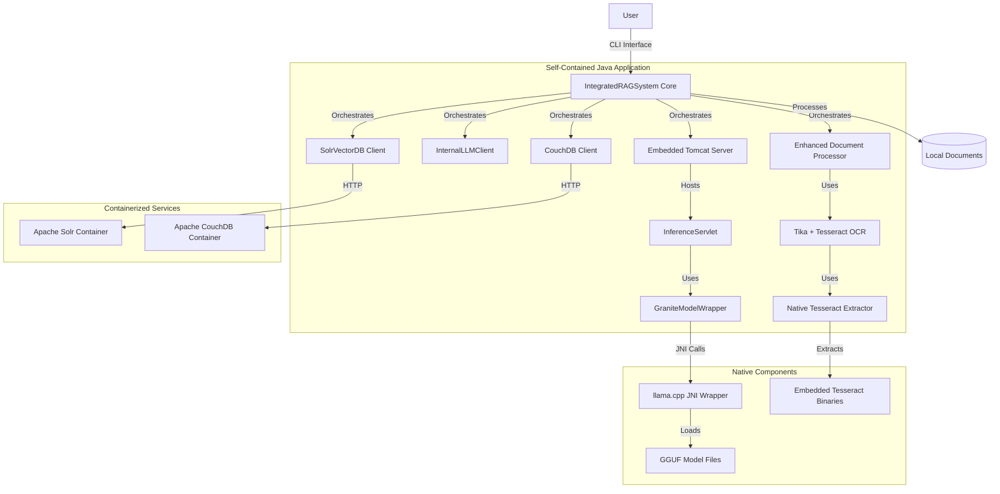
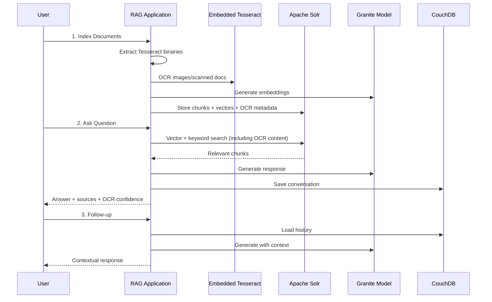

# Self-Contained RAG Notebook

A fully containerized, local-first RAG (Retrieval-Augmented Generation) application that functions as a personal notebook. Built entirely on open-source technologies with the Apache Software Foundation ecosystem at its core, this application uses a locally-run Granite LLM for generation, Apache Solr for vector search, Apache CouchDB for conversation history, and Apache Tika with embedded Tesseract OCR for comprehensive document processing.

## Table of Contents

- [Architecture Overview](#architecture-overview)
- [Features](#features)
- [Prerequisites](#prerequisites)
- [Quick Start Guide](#quick-start-guide)
- [Tesseract OCR Setup](#tesseract-ocr-setup)
- [Detailed Setup Instructions](#detailed-setup-instructions)
- [Building the Native Components](#building-the-native-components)
- [Running the Application](#running-the-application)
- [Usage Guide](#usage-guide)
- [Troubleshooting](#troubleshooting)
- [Contributing](#contributing)
- [License](#license)

## Architecture Overview

This self-contained application orchestrates multiple components to provide a complete RAG experience:



## Features

- **Fully Containerized Backend**: Apache Solr and CouchDB run in optimized Podman/Docker containers
- **Local-First RAG**: Your documents stay on your machine, no data leaves your environment
- **Self-Contained LLM**: IBM Granite model runs locally via embedded Tomcat server
- **Embedded Tesseract OCR**: Self-contained OCR processing without external dependencies
- **Advanced Document Processing**: PDFs, images, scanned documents via Apache Tika + Tesseract
- **Hybrid Vector Search**: Semantic search combined with keyword search using Apache Solr
- **Conversational Memory**: Full conversation history stored in CouchDB
- **Cross-Platform Support**: Works on Windows, Linux, and macOS with embedded native binaries
- **Native Performance**: llama.cpp integration for efficient model inference

## Prerequisites

### Required Software

- **Git**: For cloning the repository and submodules
- **Java 17**: OpenJDK 17 or equivalent
- **Apache Maven 3.8+**: For building the project
- **Container Runtime**: One of the following:
  - **Podman** with **podman-compose** (recommended)
  - **Docker** with **Docker Compose**
- **C++ Build Tools**:
  - **CMake 3.15+**
  - **GCC 9+** or **Clang 10+**
  - **Make**

### System Requirements

- **RAM**: Minimum 8GB, recommended 16GB+ (for model inference)
- **Storage**: 10GB+ free space (for models and dependencies)
- **CPU**: Multi-core processor recommended for compilation

## Quick Start Guide

### 1. Clone and Initialize Repository

```bash
# Clone the repository
git clone <repository-url>
cd integrated-rag-system-self-contained

# Initialize the llama.cpp submodule
git submodule add https://github.com/ggerganov/llama.cpp.git
git submodule update --init --recursive
```

### 2. Set Up Tesseract OCR Binaries

```bash
# Run the Tesseract setup script
chmod +x collect_binaries_script.sh
./collect_binaries_script.sh
```

Follow the platform-specific instructions in the [Tesseract OCR Setup](#tesseract-ocr-setup) section to obtain and place the required binaries.

### 3. Download the Granite Model

Create a `models` directory and download the quantized GGUF model:

```bash
mkdir -p models
cd models

# Download the IBM Granite 8B Instruct model (Q4_K_M quantization)
# You can get this from: https://huggingface.co/ibm-granite/granite-8b-instruct-v3.2-gguf
# Example using wget or curl:
wget https://huggingface.co/ibm-granite/granite-8b-instruct-v3.2-gguf/resolve/main/granite-8b-instruct-v3.2.Q4_K_M.gguf

cd ..
```

### 4. Prepare Your Documents

Create a directory for your source documents:

```bash
mkdir -p source-documents
# Copy your documents (PDFs, DOCX, images, scanned documents, etc.) to this directory
```

### 5. Build and Run

```bash
# Build the application with native components
mvn clean package -Pnative-build

# Start the containerized services
podman-compose up -d

# Configure Solr schema
./scripts/configure-solr.sh

# Run the application
java -Djava.library.path=./llama.cpp/build -jar target/integrated-rag-system-self-contained-2.0.0.jar
```

## Tesseract OCR Setup

This application embeds Tesseract OCR binaries to provide OCR capabilities without requiring users to install Tesseract separately. The embedded approach ensures consistent OCR performance across all platforms.

### Directory Structure

After running `collect_binaries_script.sh`, you’ll have this structure:

```
src/main/resources/
├── native/
│   ├── windows-x64/     # Windows binaries
│   │   ├── tesseract.exe
│   │   ├── libleptonica-5.dll
│   │   └── libtesseract-5.dll
│   ├── linux-x64/       # Linux binaries
│   │   ├── tesseract
│   │   ├── libtesseract.so.5
│   │   └── libleptonica.so.5
│   └── macos-x64/       # macOS binaries
│       ├── tesseract
│       ├── libtesseract.5.dylib
│       └── libleptonica.5.dylib
└── tessdata/            # Language data files
    ├── eng.traineddata
    ├── fra.traineddata
    └── deu.traineddata
```

### Platform-Specific Binary Collection

#### Windows (windows-x64)

1. Visit the [UB-Mannheim Tesseract releases](https://github.com/UB-Mannheim/tesseract/wiki)
1. Download the latest Windows installer
1. Install Tesseract to a temporary location
1. Copy the required files:
   
   ```cmd
   copy "C:\Program Files\Tesseract-OCR\tesseract.exe" src\main\resources\native\windows-x64\
   copy "C:\Program Files\Tesseract-OCR\libleptonica-5.dll" src\main\resources\native\windows-x64\
   copy "C:\Program Files\Tesseract-OCR\libtesseract-5.dll" src\main\resources\native\windows-x64\
   ```

#### Linux (linux-x64)

1. Install Tesseract via package manager:
   
   ```bash
   # Ubuntu/Debian
   sudo apt-get update
   sudo apt-get install tesseract-ocr libtesseract-dev libleptonica-dev
   
   # CentOS/RHEL/Fedora
   sudo dnf install tesseract tesseract-devel leptonica-devel
   ```
1. Copy the required files:
   
   ```bash
   cp /usr/bin/tesseract src/main/resources/native/linux-x64/
   cp /usr/lib/x86_64-linux-gnu/libtesseract.so.5 src/main/resources/native/linux-x64/
   cp /usr/lib/x86_64-linux-gnu/libleptonica.so.5 src/main/resources/native/linux-x64/
   ```

#### macOS (macos-x64)

1. Install Tesseract via Homebrew:
   
   ```bash
   brew install tesseract
   ```
1. Copy the required files:
   
   ```bash
   # For Intel Macs
   cp /usr/local/bin/tesseract src/main/resources/native/macos-x64/
   cp /usr/local/lib/libtesseract.5.dylib src/main/resources/native/macos-x64/
   cp /usr/local/lib/libleptonica.5.dylib src/main/resources/native/macos-x64/
   
   # For Apple Silicon Macs (M1/M2)
   cp /opt/homebrew/bin/tesseract src/main/resources/native/macos-x64/
   cp /opt/homebrew/lib/libtesseract.5.dylib src/main/resources/native/macos-x64/
   cp /opt/homebrew/lib/libleptonica.5.dylib src/main/resources/native/macos-x64/
   ```

### Language Data Files (tessdata)

Download language model files for OCR:

```bash
# Download English (required)
curl -L https://github.com/tesseract-ocr/tessdata/raw/main/eng.traineddata \
     -o src/main/resources/tessdata/eng.traineddata

# Download French (optional)
curl -L https://github.com/tesseract-ocr/tessdata/raw/main/fra.traineddata \
     -o src/main/resources/tessdata/fra.traineddata

# Download German (optional)
curl -L https://github.com/tesseract-ocr/tessdata/raw/main/deu.traineddata \
     -o src/main/resources/tessdata/deu.traineddata
```

### Verification

Verify your binary collection:

```bash
find src/main/resources/native -type f
find src/main/resources/tessdata -type f
```

## Detailed Setup Instructions

### Container Configuration

The application uses a `compose.yml` file optimized for Podman containers. This configuration provides:

- **Apache Solr 9.6**: Pre-configured with the `documents` core
- **Apache CouchDB 3.3**: With persistent storage and admin credentials
- **Persistent Volumes**: Data survives container restarts

The compose file is already included in the repository:

```yaml
version: '3.8'
services:
  solr:
    image: solr:9.6
    ports:
      - "8983:8983"
    volumes:
      - solr_data:/var/solr
    command:
      - solr-precreate
      - documents

  couchdb:
    image: couchdb:3.3
    ports:
      - "5984:5984"
    volumes:
      - couchdb_data:/opt/couchdb/data
    environment:
      - COUCHDB_USER=admin
      - COUCHDB_PASSWORD=password

volumes:
  solr_data:
  couchdb_data:
```

### Starting Containerized Services

For **Podman** (recommended):

```bash
# Start services
podman-compose up -d

# Check status
podman-compose ps

# View logs
podman-compose logs -f
```

For **Docker**:

```bash
# Start services
docker-compose up -d

# Check status
docker-compose ps

# View logs
docker-compose logs -f
```

### Configuring Application Properties

Create or update `src/main/resources/application.properties`:

```properties
# Model and document paths (use absolute paths)
rag.config.graniteModelPath=/absolute/path/to/your/project/models/granite-8b-instruct-v3.2.Q4_K_M.gguf
rag.config.documentsPath=/absolute/path/to/your/project/source-documents

# Service URLs (match the compose.yml configuration)
rag.config.solrUrl=http://localhost:8983/solr
rag.config.couchDbUrl=http://localhost:5984

# CouchDB authentication
rag.config.couchDbUsername=admin
rag.config.couchDbPassword=password
rag.config.couchDbDatabase=rag_conversations

# Embedding and chunking settings
rag.config.chunkSize=1000
rag.config.chunkOverlap=200
rag.config.embeddingDimension=384

# Tesseract OCR settings (automatically configured)
rag.config.tesseractLanguages=eng+fra+deu
rag.config.ocrEnabled=true
```

## Building the Native Components

The application requires building native components for optimal performance:

### 1. Build llama.cpp Library

```bash
# Navigate to the llama.cpp submodule
cd llama.cpp

# Create build directory
mkdir -p build && cd build

# Configure with CMake (enable shared library)
cmake .. -DBUILD_SHARED_LIBS=ON -DCMAKE_BUILD_TYPE=Release

# Build the library
make -j$(nproc)

# Verify the shared library was created
ls -la libllama.so  # On Linux
ls -la libllama.dylib  # On macOS

cd ../..
```

### 2. Build Java Application with Native Profile

The Maven build includes a special profile for native compilation:

```bash
# Clean and build with native components
mvn clean package -Pnative-build

# This profile will:
# - Compile the llama.cpp wrapper
# - Generate JNI headers
# - Build the Java application
# - Create a fat JAR with all dependencies
# - Embed Tesseract binaries and tessdata
```

### 3. Configure Solr Schema

After starting the containers, configure Solr for vector search:

```bash
# Add vector field type for embeddings
curl -X POST -H 'Content-type:application/json' \
  --data-binary '{
    "add-field-type": {
      "name": "knn_vector",
      "class": "solr.DenseVectorField",
      "vectorDimension": "384",
      "similarityFunction": "cosine"
    }
  }' \
  http://localhost:8983/solr/documents/schema

# Add document fields
curl -X POST -H 'Content-type:application/json' \
  --data-binary '{
    "add-field": [
      {"name": "title", "type": "text_general", "stored": true},
      {"name": "content", "type": "text_general", "stored": true},
      {"name": "file_path", "type": "string", "stored": true},
      {"name": "vector", "type": "knn_vector", "stored": true},
      {"name": "has_ocr", "type": "boolean", "stored": true},
      {"name": "ocr_confidence", "type": "pfloat", "stored": true}
    ]
  }' \
  http://localhost:8983/solr/documents/schema

echo "✓ Solr schema configured successfully"
```

## Running the Application

### 1. Start Backend Services

```bash
# Start Solr and CouchDB containers
podman-compose up -d

# Wait for services to be ready
sleep 30

# Configure Solr schema (run once)
./scripts/configure-solr.sh
```

### 2. Launch the RAG Application

```bash
# Set the native library path and run
java -Djava.library.path=./llama.cpp/build \
     -Xmx8g \
     -jar target/integrated-rag-system-self-contained-2.0.0.jar
```

### 3. Application Startup Sequence

The application will:

1. **Extract Native Libraries**: Tesseract binaries are extracted to temporary directory
1. **Load Configuration**: Read application.properties
1. **Initialize Components**: Start Tomcat server, load Granite model
1. **Connect to Services**: Verify Solr and CouchDB connectivity
1. **Present CLI Menu**: Interactive command-line interface

Look for these startup messages:

```
✓ Tesseract native libraries extracted to: /tmp/tesseract-native-xxxxx
✓ Enhanced Document Processor with embedded Tesseract ready
✓ Apache Tika configured with Tesseract OCR support
```

## Usage Guide

### Initial Document Indexing

1. **Select “Index Documents”** from the main menu
1. The system will:
- Process all files in your `source-documents` directory
- Use Apache Tika for standard document extraction
- Apply Tesseract OCR for images and scanned documents
- Generate embeddings using the local Granite model
- Store chunks and vectors in Solr
- Display progress and OCR statistics

### Document Processing Capabilities

The enhanced document processor supports:

- **Standard Documents**: PDF, DOCX, TXT, HTML
- **Images with Text**: PNG, JPEG, TIFF, BMP
- **Scanned Documents**: PDF with embedded images
- **Multi-language OCR**: English, French, German (configurable)
- **High-quality OCR**: 300 DPI processing for optimal text extraction

### Querying Your Documents

1. **Select “Ask a Question”** from the main menu
1. **Enter your question** in natural language
1. The system will:
- Search for relevant document chunks (including OCR’d content)
- Generate a contextual response using Granite
- Display the answer with source citations
- Save the conversation to CouchDB

### Follow-up Questions

The system maintains conversational context:

- Ask follow-up questions like “Can you elaborate on that?”
- Reference previous responses: “What did you mean by X?”
- The conversation history enhances response quality

### OCR-Enhanced Features

The embedded Tesseract integration provides:

- **Automatic OCR Detection**: Images and scanned documents are processed automatically
- **Multi-language Recognition**: Configurable language support
- **Confidence Scoring**: OCR quality metrics stored with documents
- **Fallback Processing**: Standard text extraction for non-OCR documents

### Usage Flow



## Troubleshooting

### Common Issues

**Container Startup Issues**:

```bash
# Check container status
podman-compose ps

# View container logs
podman-compose logs solr
podman-compose logs couchdb

# Restart services
podman-compose down && podman-compose up -d
```

**Model Loading Errors**:

- Verify model file path in `application.properties`
- Ensure sufficient RAM (8GB+ recommended)
- Check model file integrity

**Tesseract OCR Issues**:

- Verify native binaries are properly extracted
- Check tessdata files are present and not corrupted
- Monitor memory usage during OCR processing
- Look for extraction log messages at startup

**Build Failures**:

```bash
# Clean build
mvn clean

# Build with debug info
mvn package -Pnative-build -X

# Check Java/Maven versions
java -version
mvn -version
```

### Tesseract-Specific Troubleshooting

**Library not found errors**:

- Ensure all required files are present for your platform
- Check that library versions match (e.g., `libtesseract.so.5` not `libtesseract.so.4`)

**Permission denied errors**:

- The extractor automatically sets execute permissions
- Verify temporary directory permissions

**OCR quality issues**:

- Check input image resolution (300 DPI recommended)
- Verify language data files are complete
- Monitor OCR confidence scores in search results

**Large JAR size**:

- Remove unused platform binaries if targeting specific platforms only
- Remove unused language data files
- Final JAR size will be ~150-300MB depending on included platforms

### Performance Tuning

**Memory Settings**:

```bash
# Increase JVM heap for large document sets and OCR processing
java -Djava.library.path=./llama.cpp/build -Xmx16g -jar target/integrated-rag-system-self-contained-2.0.0.jar
```

**Container Resources**:

```bash
# For Podman, increase memory limits
podman-compose up -d --memory 4g
```

**OCR Performance**:

- Batch process large image collections
- Monitor system resources during OCR operations
- Consider preprocessing images for optimal OCR quality

## Development and Contributing

### Project Structure

```
integrated-rag-system-self-contained/
├── compose.yml                     # Container orchestration
├── pom.xml                        # Maven configuration
├── collect_binaries_script.sh     # Tesseract binary setup script
├── llama.cpp/                     # Submodule for native LLM
├── models/                        # GGUF model files
├── source-documents/              # Your document collection
├── src/main/java/com/notebooklm/  # Application source code
├── src/main/resources/            # Configuration files
│   ├── native/                    # Embedded Tesseract binaries
│   ├── tessdata/                  # OCR language data
│   └── application.properties     # Configuration
├── scripts/                       # Setup and utility scripts
├── docs/                          # Additional documentation
│   ├── embedded_tesseract_setup.md
│   └── readme_tesseract.md
└── target/                        # Build output
```

### Key Components

- **IntegratedRAGSystem**: Main application orchestrator
- **GraniteModelWrapper**: JNI interface to llama.cpp
- **EnhancedDocumentProcessor**: Tika + Tesseract integration
- **TesseractNativeExtractor**: Runtime extraction of embedded binaries
- **SolrVectorDB**: Vector search implementation
- **CouchDBClient**: Conversation persistence
- **LLMServer**: Embedded Tomcat inference server

### Contributing Guidelines

1. **Fork the repository**
1. **Create a feature branch**: `git checkout -b feature/your-feature`
1. **Test with multiple document types** including images and scanned documents
1. **Update documentation** as needed, especially for OCR-related changes
1. **Ensure cross-platform compatibility** if modifying native components
1. **Submit a pull request**

## License

This project is licensed under the Apache License, Version 2.0.

### Third-Party Components

|Component     |License   |Purpose              |
|--------------|----------|---------------------|
|Apache Solr   |Apache 2.0|Vector search engine |
|Apache CouchDB|Apache 2.0|Document database    |
|Apache Tika   |Apache 2.0|Document processing  |
|Apache Tomcat |Apache 2.0|Embedded web server  |
|Tesseract OCR |Apache 2.0|OCR processing engine|
|llama.cpp     |MIT       |LLM inference engine |
|IBM Granite   |Custom    |Language model       |

## Support and Resources

- **Documentation**: Check the `docs/` directory for detailed guides
  - `embedded_tesseract_setup.md`: Comprehensive Tesseract integration guide
  - `readme_tesseract.md`: Platform-specific binary collection instructions
- **Issues**: Report bugs and feature requests via GitHub Issues
- **Discussions**: Join community discussions for help and ideas
- **Apache Software**: Learn more about the Apache ecosystem at [apache.org](https://apache.org)
- **Tesseract OCR**: Official documentation at [tesseract-ocr.github.io](https://tesseract-ocr.github.io)

## Important Notes

### File Sizes and Performance

- Native binaries add ~20-50MB per platform
- Language data files are ~10-15MB each
- Final JAR size: ~150-300MB depending on included platforms and languages
- First-run extraction adds ~2-5 seconds to startup time
- OCR processing may require additional memory and processing time

### Platform Support

- Windows (x64): Full support with embedded binaries
- Linux (x64): Full support with embedded binaries
- macOS (x64): Full support with embedded binaries
- The application auto-detects platform and extracts appropriate binaries

### OCR Capabilities

- Supports 100+ languages via tessdata files
- Handles images, scanned PDFs, and mixed document types
- Provides confidence scoring for OCR quality assessment
- Integrates seamlessly with existing document processing pipeline

-----

**Ready to get started?** Follow the [Quick Start Guide](#quick-start-guide) to have your local RAG notebook with advanced OCR capabilities running in minutes!